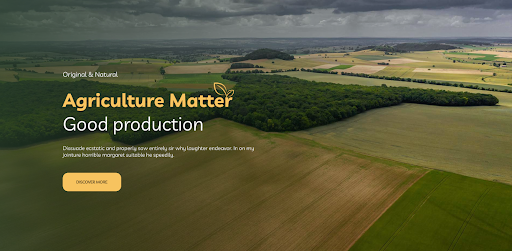
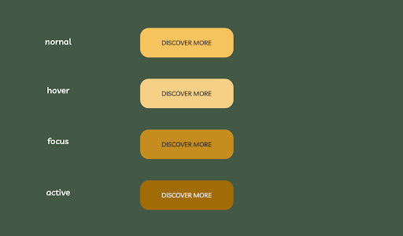
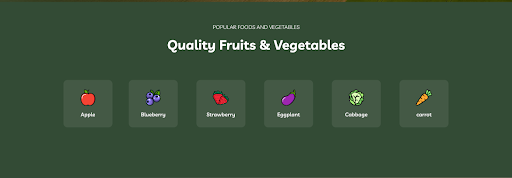
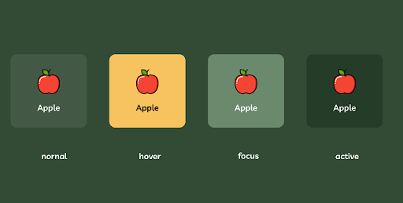

# Задачи
## Задача А
### Стилизация. Начало
Добавить необходимые стили по макету в фигме первому блоку, а именно: фоновое изображение(скачать в фигме), стилизация текста(цвет и его основные свойства, так же посмотреть в фигме) и кнопку(ее стили все также взять из фигмы).

## Задача В
###  Стилизация. Анимации.
Проанализировав весь ui-kit, найти в нем как должна выглядеть кнопка первого блока при различных состояниях(hover, focus, active) и реализовать эти состояния с плавностью в обе стороны в 0.3 секунды.
В ui-kit:

## Задача С
###  Стилизация. Второй блок.
### Задание
По аналогии с первыми двумя практиками стилизовать и анимировать второй блок.
### По стилизации:
Цвет фона, прописать стили текста, стили кнопок с овощами и фруктами
Доработать предыдущую  работу следующим образом:

### По анимации:
Прописать стили ко всем состояниям с плавностью в обе стороны 0.3 секунды

